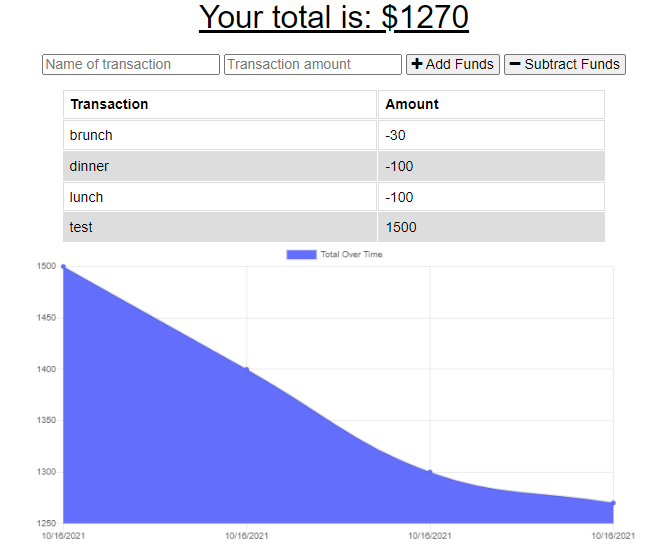

# Budget Tracker


  ## Description
  Acceptance Criteria:

  ```
  GIVEN a budget tracker without an internet connection
  WHEN the user inputs an expense or deposit
  THEN they will receive a notification that they have added an expense or deposit
  WHEN the user reestablishes an internet connection
  THEN the deposits or expenses added while they were offline are added to their transaction history and their totals are updated
```

  ## Table of Contents
  - [Description](#description)
  - [Installation](#installation)
  - [Usage](#usage)
  - [License](#license)
  - [Credits](#credits)

  ## Installation
  `npm init`
  `npm i` 

  ## Usage
  Run "npm start" command at the root of the file to view the application in browser.
  Exist using "ctrl + C" and type "Y" in the terminal.

  Below is a screenshot of the [deployed application](https://lit-mesa-27218.herokuapp.com/): 

   

  ## License
  This application is covered by [MIT](https://opensource.org/licenses/MIT) license. 
  
  ## Credits: 
  https://courses.bootcampspot.com/
